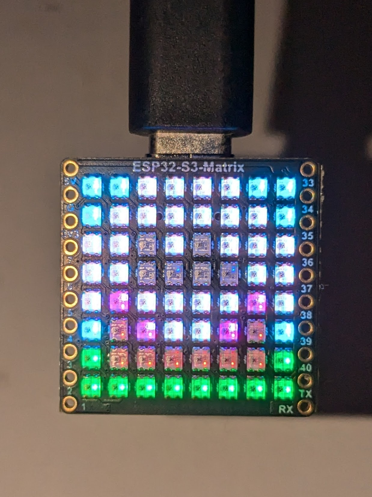
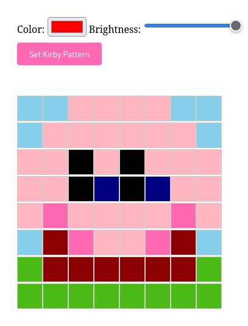
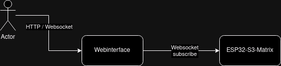

# Pixel Portal

| display                                             | web interface                                            |
| --------------------------------------------------- | -------------------------------------------------------- |
|  |  |

The web interface looks like:
[Screenshot placeholder]

## Overview

A creative implementation for a Christmas coding challenge using an ESP32-S3-Matrix display board. This project connects to a Cloud Run service to receive pixel data through WebSockets, enabling remote control of the LED matrix display.

The setup consistes of users using a their webbrowswer, the backend, and the ESP32-S3-Matrix display board. The backend is running on GCP Cloud Run, and the display needs to conenct to wifi to connect to the backend over a websocket.

## Features

- Real-time pixel updates via WebSocket
- Web-based interface for drawing
- ESP32 LED matrix display integration
- Cloud-hosted backend with automatic scaling
- Multi-user support

## Usage

1. Access the web interface at [https://pixel-portal-xpv3wpdyrq-ew.a.run.app](https://pixel-portal-xpv3wpdyrq-ew.a.run.app/)
2. Click to draw pixels
3. Changes appear instantly on connected displays

You can also view the websocket data using the [listener page](https://pixel-portal-xpv3wpdyrq-ew.a.run.app/listener.html)

## Hardware Requirements

- [Waveshare ESP32-S3-Matrix](https://www.waveshare.com/esp32-s3-matrix.htm)
- USB-C cable for programming

## Prerequisites

- VS Code with ESP-IDF extension
- Google Cloud SDK
- Podman
- Terraform

## Setup and deployment

To run the project the backend needs to be runing. I've used GCP Cloud Run, but it could be anwhere. The Firmware needs to be written to to the ESP32. For this I've used VScode and ESP-IDF.

## Building and Flashing Firmware

1. Setup VScode with insalling the ESP-IDF extension
2. Setup wifi and certs
   a. `cp firmware/main/secrets.h.example firmware/main/secrets.h` and update `firmware/main/secrets.h`
   b. Generate updated CA certs file by running `cd firmware && firmware/scripts/get_ca_cert.sh`
3. Build using `idf.py build`. This should:
   a. Download the components I've used
   b. Compile all the different binaries required
4. Flash to the ESP32 with `idf.py flash`

### Deploying backend

1.  Within the backend path `cd backend`
2.  Build backend image `podman build -t pixel-portal .`
3.  Push image `podman push localhost/pixel-portal:latest europe-west1-docker.pkg.dev/pixel-project-d6a7/pixel-portal-repo/pixel-portal:v0.0.1-manual3`
4.  Move to terraform folder `cd terraform`
5.  Update TF to use new image `vim main.tf`
6.  Apply TF `terraform apply`

## Architecture

A fairly strightforwad setup where the users interact with the web interface. Which talks to the backend over a websocket. The ESP32 also listens for updates from the websocket. The backend doesn't hold any state, just broadcasts the pixel updates to all websocket clients.

